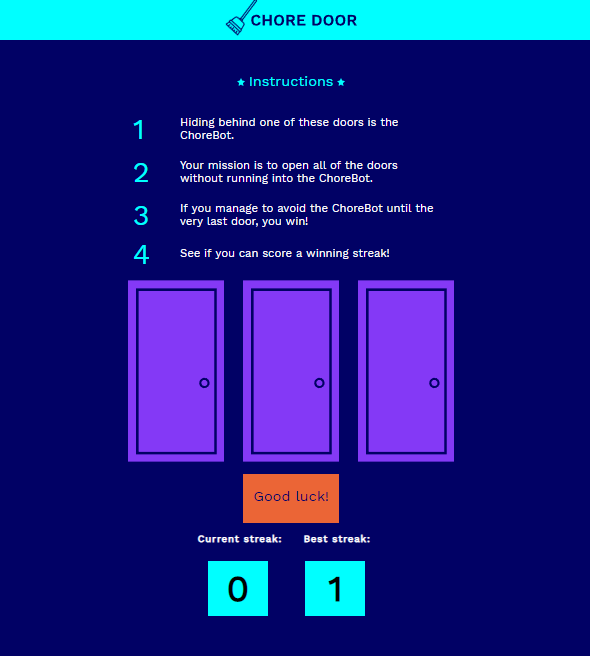

#### DOM EVENTS WITH JAVASCRIPT

# Chore Door

#### Interactive Website:
Please download the files and open the html;

- *click on the image to be redirected to the interactive website*

#### Description:
- robot is standing behind one of the three doors
- open the door with the robot last to win

#### Guided by [Codeacademy](http://ssqt.co/mQfdNdy)

#### [Back to 'Practice'](https://github.com/soohyeok/Practice)
