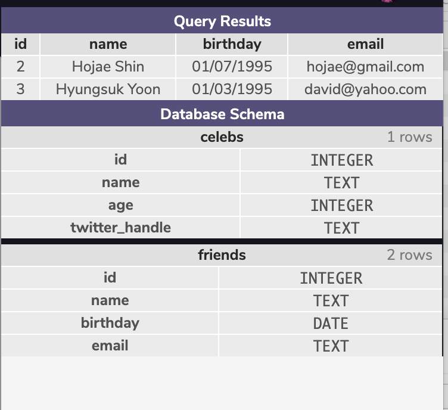

#### LEARN SQL

# Create A Table

#### Description:
- *Learn SQL*
- Creating Table
- Basic Manipulation commands

#### Images:

#### Guided by [Codeacademy](http://ssqt.co/mQfdNdy)
#### [Back to 'Practice'](https://github.com/soohyeok/Practice)
