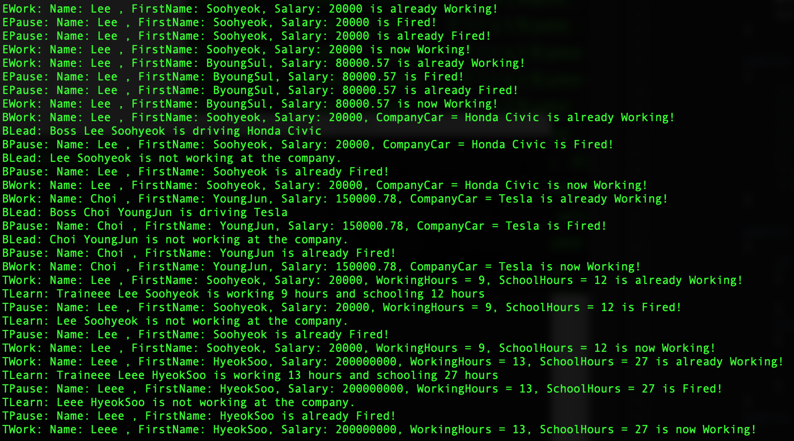

#### C#

# Employee

#### Description:
- C# Inheritance Practice

Inheritance Challenge - Employees, Bosses and Trainees
Create a main class with a Main Method, then a base class Employee with the properties
Name, FirstName, Salary and the methods Work() and Pause().

Create a deriving class boss with the propertie CompanyCar and the method Lead().
Create another deriving class of employees - trainees with the properties WorkingHours and SchoolHourse and a method Learn().

Override the methods Work() of the trainee class so that it indicates the working hours of the trainee.

Don’t forget to create the constructors.

Create an object of each of the three classes (with arbitrary values)

and call the methods, Lead() of Boss and Work() of Trainee.

Just print out the respective text, what the respective employees do.

#### Images:

#### [Back to 'Practice'](https://github.com/soohyeok/Practice)
