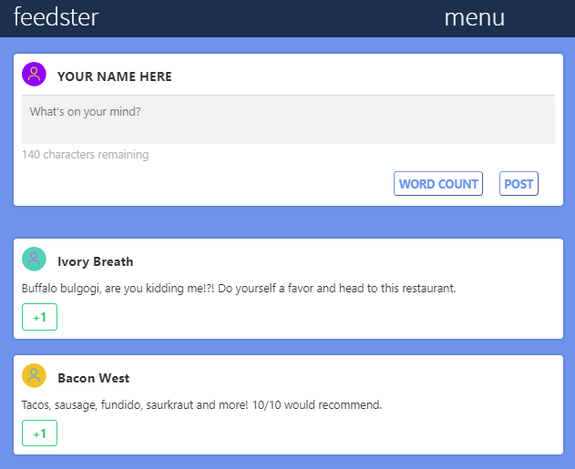
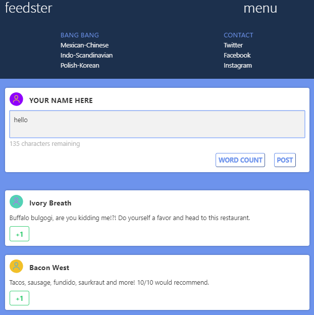
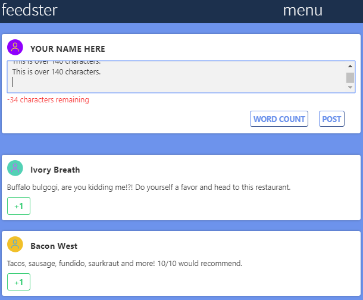

#### LEARN JQUERY: EVENT HANDLERS

# Feedster

#### Description:
- Practice with Chaining Events in jQuery
- Button class adder/remover
- Character Counter
- Menu drop/hide

#### Images:
- index:

- With menu:

- With extra words:

#### Guided by [Codeacademy](http://ssqt.co/mQfdNdy)
#### [Back to 'Practice'](https://github.com/soohyeok/Practice)
