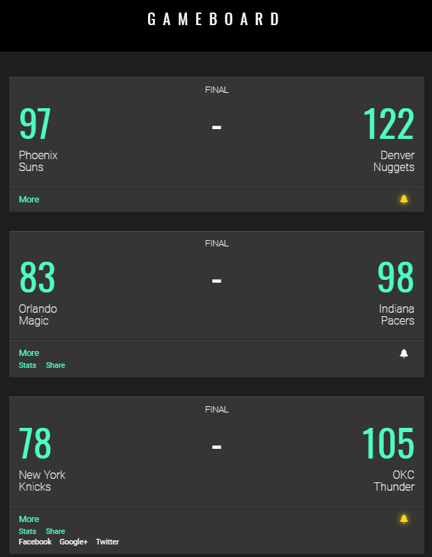

#### LEARN JQUERY: TRAVERSING THE DOM

# Gameboard

#### Description:
- Learn jQuery: Traversing The DOM
- Use jQuery to toggle menus and submenus.

#### Images:

#### Guided by [Codeacademy](http://ssqt.co/mQfdNdy)
#### [Back to 'Practice'](https://github.com/soohyeok/Practice)
