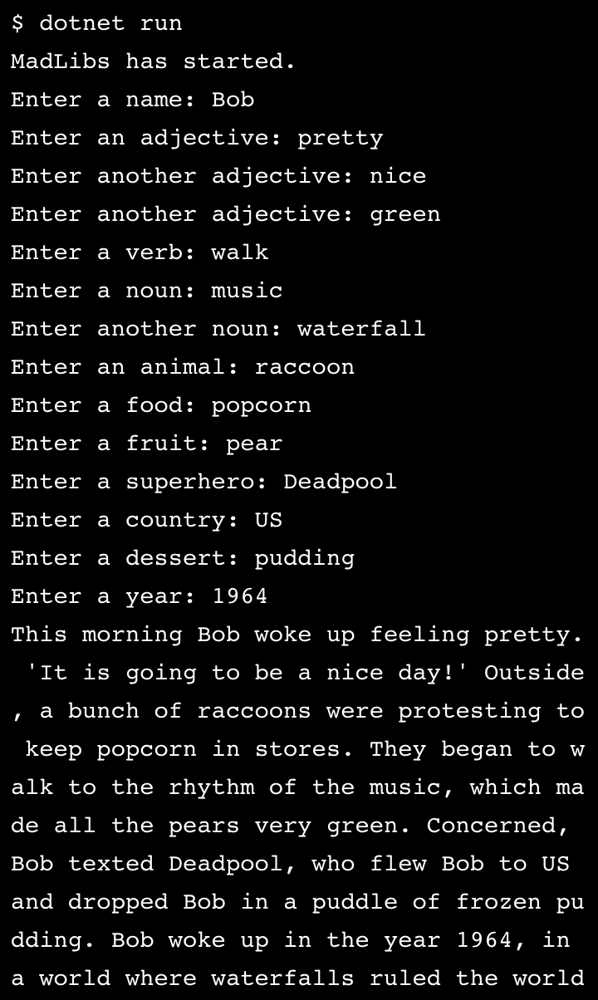

#### LEARN C#

# MadLibs

#### Description:
- *Learn C#*
- Basic Madlibs
- Basic Data Types
- Console.Write/Read
- string concatenation, interpolation

#### Images:

#### Guided by [Codeacademy](http://ssqt.co/mQfdNdy)
#### [Back to 'Practice'](https://github.com/soohyeok/Practice)
