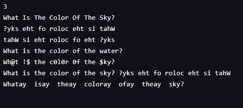

#### LEARN JAVASCRIPT: MODULES

# Message Mixer

#### Description:
- Learn Javascript: Modules
- Using modules: exports/imports/require

- count the characters in a message
- capitalize the first character of words
- reverse a message’s words in place
- reversing characters in place
- replace the first occurrence of a string
- replace all occurrences of a string
- encode text by swapping certain characters for other characters

#### Images:

#### Guided by [Codeacademy](http://ssqt.co/mQfdNdy)
#### [Back to 'Practice'](https://github.com/soohyeok/Practice)
