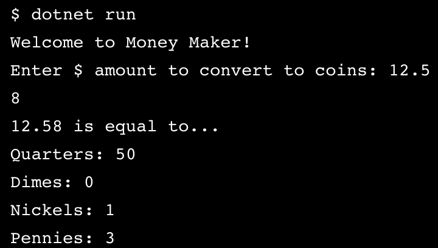

#### LEARN C#

# MoneyMaker

#### Description:
- *Learn C#*
- Basic Coin Calculator: converting $ amount into # of coins

#### Images:

#### Guided by [Codeacademy](http://ssqt.co/mQfdNdy)
#### [Back to 'Practice'](https://github.com/soohyeok/Practice)
