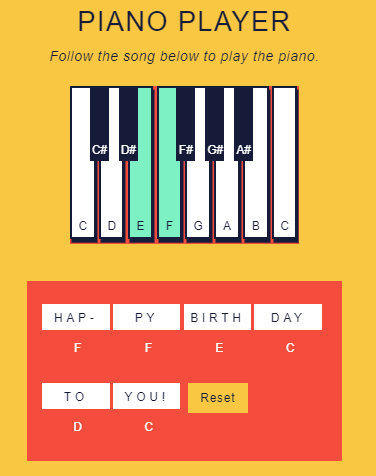

#### DOM EVENTS WITH JAVASCRIPT

# Piano Keys

### Codeacademy Content

#### Interactive Website:
Please download the files and open the html;

#### Description:
- Piano Keys highlight(change color) when pressed
- The Next button allows one to see the next 8 measures of the music where
    Next (8measures) -> Next (8measures) -> Repeat (8measures)
#### Project Link:
- https://www.codecademy.com/paths/web-development/tracks/build-interactive-websites/modules/dom-javascript-events/projects/piano-keys
