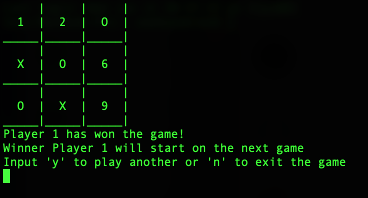

#### C#

# TicTacToe

#### Description:
- Console TicTacToe in C#

#### Program.cs  (with Main)
- asking user who will start first p1 or p2
- asking user to playing again
#### TicTacToe.cs
- user input (1~9 on board)
- checking for winner
- board display
- tried to create a public method to call the 3 private methods listed above

#### Images:

#### [Back to 'Practice'](https://github.com/soohyeok/Practice)
