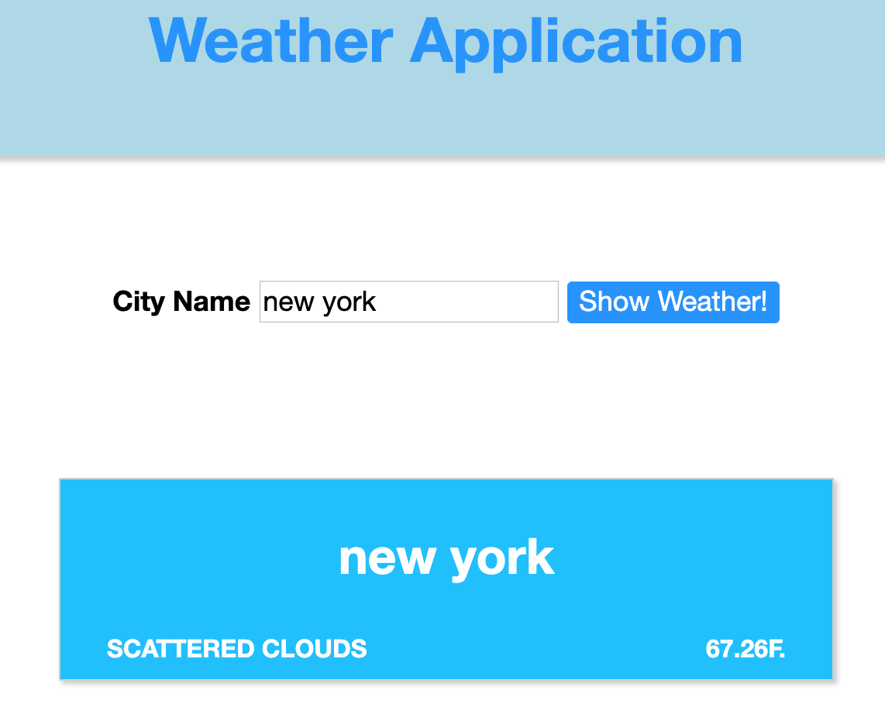

#### Vanilla JS with API call / DOM practice

# WeatherApplication

#### Description:
- OpenWeatherMap API call with Vanilla JS
- html, css, js
- DOM navigation/control
- when town/city name is searched, the application returns city name, weather description and temperature

### Run Instructions
- download three .js files
- go to https://openweathermap.org/
- sign up (free) to get API Key
- go into project.js file and paste in your API key

#### Images:

#### Guided by [Udemy Course](https://www.udemy.com/javascript-bootcamp-2016/)
#### [Back to 'Practice'](https://github.com/soohyeok/Practice)
