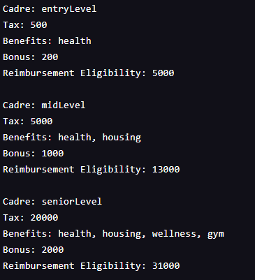

#### LEARN JAVASCRIPT: MODULES

# WorkARound

#### Description:
- Learn Javascript: Modules
- Using modules: export, export default, exporting functions as properties

return the cadre of the of the employee, in other words, whether this employee is entry level, mid level, or senior level.
calculate employee tax rates
return employee benefits
calculate employee bonuses
calculate the total amount an employee can be reimbursed based on the total value of their health, housing, or wellness benefits

#### Images:

#### Guided by [Codeacademy](http://ssqt.co/mQfdNdy)
#### [Back to 'Practice'](https://github.com/soohyeok/Practice)
